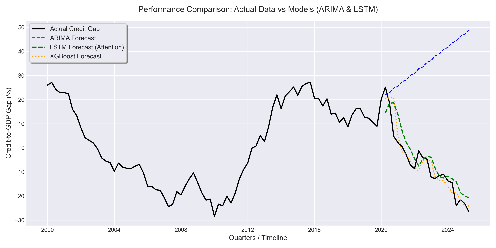
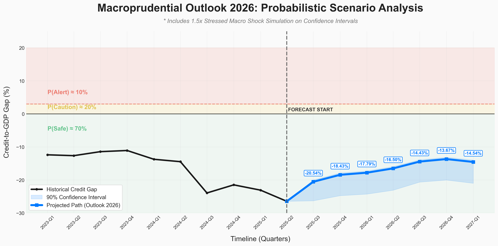

# Trinitas Forecast & Quadrilateral Model: Macroprudential Outlook

This project explores the use of artificial intelligence and advanced statistics to monitor financial stability through Indonesia's **Credit-to-GDP Gap** indicator using an integrated multi-variable approach.

---

## 🧭 Core Methodology: Trinitas Forecast
The system processes three key macroeconomic pillars for policy synchronization:
-   **Total Credit**: Banking lending volume (IDR).
-   **Real GDP**: Indicator of real economic growth.
-   **Interest Rate**: Catalyst for capital cost and policy transmission.

Data is processed using the **Hodrick-Prescott (HP) Filter** (Basel III Standard) to separate fundamental trends from cyclical gaps.

---

## 🧠 Forecasting Engine: Quadrilateral Prediction System
The system integrates four models (Quadrilateral) to provide a comprehensive view:

1. **LSTM (Attention-based Deep Learning)**: Captures long-term memory and volatility dynamics.
2. **XGBoost (Non-Linear Pattern)**: High precision in detecting relationships between macro-variables.
3. **ARIMA (Statistical Baseline)**: Linear statistical anchor for medium-term trends.
4. **Ensemble (Hybrid Engine)**: Combines the strengths of LSTM and XGBoost for the most reliable forecasting results.

---

## 📊 Early Warning Indicator (EWI) Dashboard
System output is presented in a dashboard that supports:

-   **Transition Monitoring**: Detects the speed of recovery from deep under-trend zones.
-   **Policy Signals**: Traffic light indicators to detect systemic risk build-up or credit expansion space.

---

## 🖥️ Technical Summary
-   **Engine**: Python 3.14 + PyTorch.
-   **Workflow**: Pipeline orchestration via `src/main.py`.
-   **Visuals**: High-resolution assets (300 DPI) in the `results/` directory.

